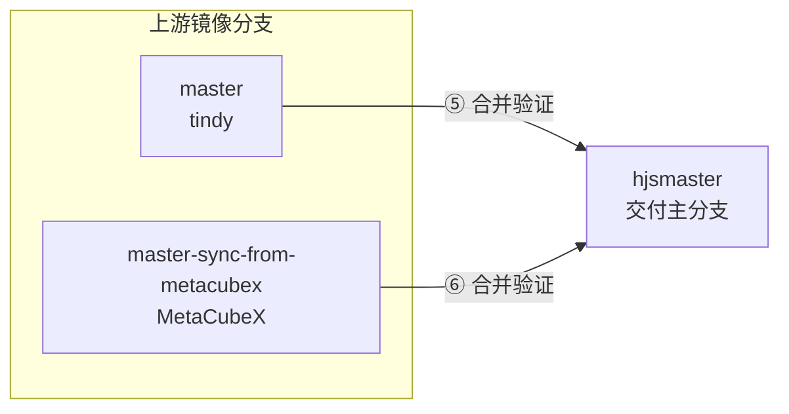

# subconverter 分支模型与上游同步技术方案

> **仓库**：`HouJia/subconverter`（fork 自 [tindy2013/subconverter](https://github.com/tindy2013/subconverter)）  
> **关联 fork**：[MetaCubeX/subconverter](https://github.com/MetaCubeX/subconverter)（本地目录常命名为 `subconverter-MetaCubeX`）  
> **版本**：2026-05-19

## 目录

- [1. 目标](#1-目标)
- [2. 分支职责](#2-分支职责)
- [3. 远程与跟踪关系](#3-远程与跟踪关系)
- [4. 功能关系（④）](#4-功能关系④)
- [5. 同步 tindy 上游（⑤）](#5-同步-tindy-上游⑤)
- [6. 同步 MetaCubeX 上游（⑥）](#6-同步-metacubex-上游⑥)
- [7. 与 NAS 部署的关系](#7-与-nas-部署的关系)
- [8. 当前仓库状态（参考）](#8-当前仓库状态参考)

## 1. 目标

在保留 **自建能力**（NAS 部署、`max_allowed_rulesets=256`、外部配置模板等）的前提下，持续吸收：

- **tindy 原版** subconverter 的维护更新（Hysteria2、CI 等）；
- **MetaCubeX** 分支的 Mihomo 生态协议能力（VLESS、TUIC、Reality、AnyTLS 等）。

**`hjsmaster` 是唯一面向交付与集成的功能主分支**；`master` 与 `master-sync-from-metacubex` 仅作上游镜像，不直接用于 NAS 部署。

## 2. 分支职责

| 分支 | 职责 | 对应上游 |
|------|------|----------|
| **`hjsmaster`** | **我们自己的主分支**：含 ②+③ 全部能力 + NAS/deploy 等自建改动 | — |
| **`master`** | 同步 **tindy2013/subconverter** 的 `master`，保持与上游一致 | `upstream/master` |
| **`master-sync-from-metacubex`** | 追踪 **MetaCubeX/subconverter** 的 `master`，仅镜像、不混入 NAS 配置 | `metacubex/master` |

约定：

- **①** 主分支 = `hjsmaster`（GitHub 默认分支建议设为 `hjsmaster`）。
- **②** `master` = tindy 上游镜像。
- **③** `master-sync-from-metacubex` = MetaCubeX 上游镜像。
- **④** `hjsmaster` 在功能上应同时包含 ② 与 ③ 的完整能力（通过下文 ⑤⑥ 合入，而非在镜像分支上直接开发）。

## 3. 远程与跟踪关系

推荐 remote 配置（示例）：

```bash
git remote -v
# origin    git@github.com:HouJia/subconverter.git
# upstream  git@github.com:tindy2013/subconverter.git
# metacubex git@github.com:MetaCubeX/subconverter.git   # 或本地 path 仅作 fetch
```

| Remote | 用途 |
|--------|------|
| `origin` | 我们的 GitHub fork，推送 `hjsmaster` 及功能/同步分支 |
| `upstream` | tindy 原版，更新本地 `master` |
| `metacubex` | MetaCubeX 版，更新本地 `master-sync-from-metacubex` |

## 4. 功能关系（④）



- **不要在 `master` 或 `master-sync-from-metacubex` 上改 NAS、`pref.toml`、业务模板**；自建内容只进 `hjsmaster` 及从它拉出的功能分支。
- 镜像分支更新后，一律：**从 `hjsmaster` 拉临时集成分支 → 合并镜像 → 验证 → 合回 `hjsmaster`**。

## 5. 同步 tindy 上游（⑤）

**目的**：把 [tindy2013/subconverter](https://github.com/tindy2013/subconverter) 的 `master` 变更合入 `hjsmaster`。

### 5.1 步骤

```bash
# 1. 更新镜像分支 master
git fetch upstream master
git checkout master
git merge --ff-only upstream/master   # 或按上游情况 rebase，保持 master ≈ upstream
git push origin master

# 2. 从 hjsmaster 拉集成分支 A
git checkout hjsmaster
git pull origin hjsmaster
git checkout -b sync/tindy-$(date +%Y%m%d)   # 分支 A，命名示例

# 3. 合并刚同步的 master
git merge master -m "merge(tindy): sync upstream master into hjsmaster"

# 4. 验证（构建、/version、VLESS/TUIC 回归、NAS 镜像等）
#    docker buildx build -f deploy/nas/Dockerfile -t subconverter:nas-amd64 --load .
#    ./deploy/nas/deploy-to-qnap.sh

# 5. 验证通过后合回 hjsmaster
git checkout hjsmaster
git merge sync/tindy-$(date +%Y%m%d) -m "merge: tindy upstream after verification"
git push origin hjsmaster
```

### 5.2 冲突处理原则

- **优先保留 `hjsmaster` 侧**：`deploy/`、`docs/`、`max_allowed_rulesets=256`、`pref.toml` / 模板路径。
- **优先采纳 upstream 侧**：通用 C++ 修复、协议解析/导出、CI 模板（合并后确认 macOS runner 等仍可用）。

## 6. 同步 MetaCubeX 上游（⑥）

**目的**：把 [MetaCubeX/subconverter](https://github.com/MetaCubeX/subconverter) 的 `master` 变更合入 `hjsmaster`。

### 6.1 步骤

```bash
# 1. 更新镜像分支 master-sync-from-metacubex
git fetch metacubex master
git checkout master-sync-from-metacubex
git merge --ff-only metacubex/master    # 保持与 MetaCubeX master 一致
git push origin master-sync-from-metacubex

# 2. 从 hjsmaster 拉集成分支 B
git checkout hjsmaster
git pull origin hjsmaster
git checkout -b sync/metacubex-$(date +%Y%m%d)   # 分支 B

# 3. 合并镜像分支
git merge master-sync-from-metacubex -m "merge(metacubex): sync MetaCubeX master into hjsmaster"

# 4. 验证（同上，重点：VLESS/TUIC/Reality 订阅转换、NAS 源码镜像构建）

# 5. 验证通过后合回 hjsmaster
git checkout hjsmaster
git merge sync/metacubex-$(date +%Y%m%d) -m "merge: MetaCubeX upstream after verification"
git push origin hjsmaster
```

### 6.2 冲突处理原则

- 与 ⑤ 相同：**自建 deploy/配置留在 `hjsmaster`**；**协议与 mihomo 导出逻辑倾向 MetaCubeX**。
- 版本号建议维持自有标签（如 `v0.9.1-hjs`），勿与上游字符串混用 unless 有意对齐发布。

## 7. 与 NAS 部署的关系

- 生产镜像应基于 **`hjsmaster`**（或从它拉出的已验证分支）用 `deploy/nas/Dockerfile` **源码构建**，以同时包含 tindy 与 MetaCubeX 能力。
- `deploy/nas/Dockerfile.overlay` 仅叠加 `pref`、绑定 tindy 预编译镜像，**不含** MetaCubeX 协议改动，仅作应急。

详见：[技术迭代-NAS部署与NPM暴露.md](./技术迭代-NAS部署与NPM暴露.md)

## 8. 当前仓库状态（参考）

| 分支 | 说明（2026-05-19 前后） |
|------|-------------------------|
| `hjsmaster` | 含 NAS/ruleset 自建提交；MetaCubeX 能力待 ⑥ 验证后合入 |
| `master` | 与 `upstream/master` 对齐（tindy） |
| `master-sync-from-metacubex` | 与 `metacubex/master` 对齐 |
| `feature/merge-metacubex` | 已完成一次 MetaCubeX 合并 + NAS 源码构建，可作 ⑥ 的参考或验证后合入 `hjsmaster` |

**注意**：⑤ 与 ⑥ 可先后进行；若两边同时有大更新，建议 **先 tindy（⑤）再 MetaCubeX（⑥）**，或在同一集成分支上顺序 merge 后做一次完整验证。

---

**维护**：变更分支模型时请同步更新本文与 `README` 中的分支说明（如有）。
