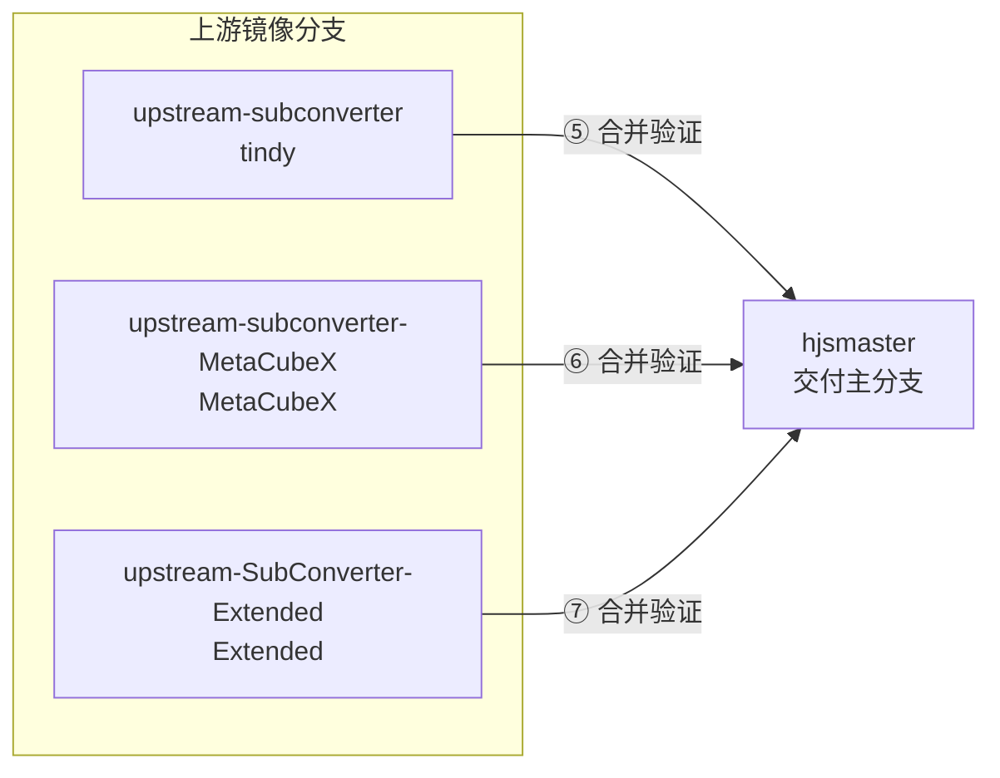

# subconverter 分支模型与上游同步技术方案

> **仓库**：`HouJia/subconverter`（fork 自 [tindy2013/subconverter](https://github.com/tindy2013/subconverter)）  
> **关联 fork**：[MetaCubeX/subconverter](https://github.com/MetaCubeX/subconverter)（本地目录常命名为 `subconverter-MetaCubeX`）  
> **Extended 官方上游**：[Aethersailor/SubConverter-Extended](https://github.com/Aethersailor/SubConverter-Extended)  
> **Extended 我们的 fork**：[HouJia/SubConverter-Extended](https://github.com/HouJia/SubConverter-Extended)（本地目录 `../SubConverter-Extended`，与 `subconverter`、`subconverter-MetaCubeX` 同级）  
> **版本**：2026-05-28

## 目录

- [1. 目标](#1-目标)
- [2. 分支职责](#2-分支职责)
- [3. 远程与跟踪关系](#3-远程与跟踪关系)
- [4. 功能关系（④）](#4-功能关系④)
- [5. 同步 tindy 上游（⑤）](#5-同步-tindy-上游⑤)
- [6. 同步 MetaCubeX 上游（⑥）](#6-同步-metacubex-上游⑥)
- [7. 同步 SubConverter-Extended 上游（⑦）](#7-同步-subconverter-extended-上游⑦)
- [8. 与 NAS 部署的关系](#8-与-nas-部署的关系)
- [9. 当前仓库状态（参考）](#9-当前仓库状态参考)
- [10. 从旧分支名迁移](#10-从旧分支名迁移)

## 1. 目标

在保留 **自建能力**（NAS 部署、`max_allowed_rulesets=256`、外部配置模板等）的前提下，持续吸收：

- **tindy 原版** subconverter 的维护更新（Hysteria2、CI 等）；
- **MetaCubeX** 分支的 Mihomo 生态协议能力（VLESS、TUIC、Reality、AnyTLS 等）；
- **SubConverter-Extended** 的扩展能力与补丁（按需合入）。

**`hjsmaster` 是唯一面向交付与集成的功能主分支**；`upstream-subconverter`、`upstream-subconverter-MetaCubeX`、`upstream-SubConverter-Extended` 仅作上游镜像，不直接用于 NAS 部署。

## 2. 分支职责

| 分支 | 职责 | 对应上游 |
|------|------|----------|
| **`hjsmaster`** | **我们自己的主分支**：含各上游镜像能力 + NAS/deploy 等自建改动 | — |
| **`upstream-subconverter`** | 同步 **tindy2013/subconverter** 的 `master`，保持与上游一致 | `upstream/master` |
| **`upstream-subconverter-MetaCubeX`** | 追踪 **MetaCubeX/subconverter** 的 `master`，仅镜像、不混入 NAS 配置 | `metacubex/master` |
| **`upstream-SubConverter-Extended`** | 追踪 **Aethersailor/SubConverter-Extended** 的 `master`，仅镜像（可在 `../SubConverter-Extended` 先同步 fork 再 fetch） | `subconverter-extended/master` |

约定：

- **①** 主分支 = `hjsmaster`（GitHub 默认分支建议设为 `hjsmaster`）。
- **②** `upstream-subconverter` = tindy 上游镜像（原 `master`）。
- **③** `upstream-subconverter-MetaCubeX` = MetaCubeX 上游镜像（原 `master-sync-from-metacubex`）。
- **④** `upstream-SubConverter-Extended` = SubConverter-Extended 上游镜像。
- **⑤** `hjsmaster` 在功能上应包含需要保留的 ②③④ 能力（通过下文 ⑤⑥⑦ 合入，而非在镜像分支上直接开发）。

## 3. 远程与跟踪关系

推荐 remote 配置（示例）：

```bash
git remote -v
# origin                 git@github.com:HouJia/subconverter.git
# upstream               git@github.com:tindy2013/subconverter.git
# metacubex              ../subconverter-MetaCubeX                    # 或 git@github.com:MetaCubeX/subconverter.git
# subconverter-extended  git@github.com:Aethersailor/SubConverter-Extended.git
#                        # 亦可 ../SubConverter-Extended 仅作 fetch（该目录 origin 为 HouJia fork）
```

| Remote | 用途 |
|--------|------|
| `origin` | 我们的 GitHub fork，推送 `hjsmaster` 及功能/同步分支 |
| `upstream` | tindy 原版，更新本地 `upstream-subconverter` |
| `metacubex` | MetaCubeX 版，更新本地 `upstream-subconverter-MetaCubeX` |
| `subconverter-extended` | Extended **官方**仓库，更新本仓库镜像分支 `upstream-SubConverter-Extended` |

**关联本地目录（与 subconverter 仓库并列）**：

| 目录 | `origin`（fork） | 建议 `upstream`（官方） |
|------|------------------|-------------------------|
| `../subconverter-MetaCubeX` | — / 按需 | `MetaCubeX/subconverter` |
| `../SubConverter-Extended` | `git@github.com:HouJia/SubConverter-Extended.git` | `git@github.com:Aethersailor/SubConverter-Extended.git` |

在 `../SubConverter-Extended` 中维护 fork 的典型流程：

```bash
cd ../SubConverter-Extended
git fetch upstream master    # upstream = Aethersailor/SubConverter-Extended
git checkout master
git merge --ff-only upstream/master
git push origin master       # 推送到 HouJia/SubConverter-Extended
```

回到 `subconverter` 仓库后，用 `git fetch subconverter-extended master` 更新镜像分支（remote 指向官方，与 fork 在同步后内容一致）。

## 4. 功能关系（④）



- **不要在镜像分支**（`upstream-subconverter` / `upstream-subconverter-MetaCubeX` / `upstream-SubConverter-Extended`）**上改 NAS、`pref.toml`、业务模板**；自建内容只进 `hjsmaster` 及从它拉出的功能分支。
- 镜像分支更新后，一律：**从 `hjsmaster` 拉临时集成分支 → 合并镜像 → 验证 → 合回 `hjsmaster`**。

## 5. 同步 tindy 上游（⑤）

**目的**：把 [tindy2013/subconverter](https://github.com/tindy2013/subconverter) 的 `master` 变更合入 `hjsmaster`。

### 5.1 步骤

```bash
# 1. 更新镜像分支 upstream-subconverter
git fetch upstream master
git checkout upstream-subconverter
git merge --ff-only upstream/master   # 或按上游情况 rebase，保持与 upstream 一致
git push origin upstream-subconverter

# 2. 从 hjsmaster 拉集成分支 A
git checkout hjsmaster
git pull origin hjsmaster
git checkout -b sync/tindy-$(date +%Y%m%d)   # 分支 A，命名示例

# 3. 合并刚同步的镜像分支
git merge upstream-subconverter -m "merge(tindy): sync upstream master into hjsmaster"

# 4. 验证（构建、/version、VLESS/TUIC 回归、NAS 镜像等）
#    docker buildx build -f deploy/nas/Dockerfile -t subconverter:nas-amd64 --load .
#    ./deploy/nas/deploy-to-qnap.sh

# 5. 验证通过后合回 hjsmaster
git checkout hjsmaster
git merge sync/tindy-$(date +%Y%m%d) -m "merge: tindy upstream after verification"
git push origin hjsmaster
```

### 5.2 冲突处理原则

- **优先保留 `hjsmaster` 侧**：`deploy/`、`docs/`、`max_allowed_rulesets=256`、`pref.toml` / 模板路径。
- **优先采纳 upstream 侧**：通用 C++ 修复、协议解析/导出、CI 模板（合并后确认 macOS runner 等仍可用）。

## 6. 同步 MetaCubeX 上游（⑥）

**目的**：把 [MetaCubeX/subconverter](https://github.com/MetaCubeX/subconverter) 的 `master` 变更合入 `hjsmaster`。

### 6.1 步骤

```bash
# 1. 更新镜像分支 upstream-subconverter-MetaCubeX
git fetch metacubex master
git checkout upstream-subconverter-MetaCubeX
git merge --ff-only metacubex/master    # 保持与 MetaCubeX master 一致
git push origin upstream-subconverter-MetaCubeX

# 2. 从 hjsmaster 拉集成分支 B
git checkout hjsmaster
git pull origin hjsmaster
git checkout -b sync/metacubex-$(date +%Y%m%d)   # 分支 B

# 3. 合并镜像分支
git merge upstream-subconverter-MetaCubeX -m "merge(metacubex): sync MetaCubeX master into hjsmaster"

# 4. 验证（同上，重点：VLESS/TUIC/Reality 订阅转换、NAS 源码镜像构建）

# 5. 验证通过后合回 hjsmaster
git checkout hjsmaster
git merge sync/metacubex-$(date +%Y%m%d) -m "merge: MetaCubeX upstream after verification"
git push origin hjsmaster
```

### 6.2 冲突处理原则

- 与 ⑤ 相同：**自建 deploy/配置留在 `hjsmaster`**；**协议与 mihomo 导出逻辑倾向 MetaCubeX**。
- 版本号建议维持自有标签（如 `v0.9.1-hjs`），勿与上游字符串混用 unless 有意对齐发布。

## 7. 同步 SubConverter-Extended 上游（⑦）

**目的**：把 [Aethersailor/SubConverter-Extended](https://github.com/Aethersailor/SubConverter-Extended) 的 `master` 变更合入 `hjsmaster`（按需、经验证后合入）。  
**Fork / 本地**：先在 [HouJia/SubConverter-Extended](https://github.com/HouJia/SubConverter-Extended) 对应目录 `../SubConverter-Extended` 与官方对齐（见 §3），再在本仓库更新镜像分支。

### 7.1 步骤

```bash
# 0a.（推荐）在并列目录同步 fork
cd ../SubConverter-Extended
git fetch upstream master && git checkout master && git merge --ff-only upstream/master
git push origin master
cd -   # 回到 subconverter

# 0b. 本仓库首次配置 remote（若尚未添加）
git remote add subconverter-extended git@github.com:Aethersailor/SubConverter-Extended.git
git fetch subconverter-extended master
# 若本地尚无镜像分支：
# git checkout -b upstream-SubConverter-Extended subconverter-extended/master

# 1. 更新镜像分支 upstream-SubConverter-Extended
git fetch subconverter-extended master
git checkout upstream-SubConverter-Extended
git merge --ff-only subconverter-extended/master
git push origin upstream-SubConverter-Extended

# 2. 从 hjsmaster 拉集成分支 C
git checkout hjsmaster
git pull origin hjsmaster
git checkout -b sync/extended-$(date +%Y%m%d)

# 3. 合并镜像分支
git merge upstream-SubConverter-Extended -m "merge(extended): sync SubConverter-Extended into hjsmaster"

# 4. 验证（构建、订阅转换、NAS 镜像；关注与 ⑤⑥ 已合入能力的重叠或冲突）

# 5. 验证通过后合回 hjsmaster
git checkout hjsmaster
git merge sync/extended-$(date +%Y%m%d) -m "merge: SubConverter-Extended upstream after verification"
git push origin hjsmaster
```

### 7.2 冲突处理原则

- **优先保留 `hjsmaster` 侧**：NAS、`deploy/`、自有 `pref` 与模板。
- Extended 与 MetaCubeX/tindy 可能改动同一模块时，以 **业务验证结果** 为准，必要时在集成分支上手工取舍后再合回 `hjsmaster`。

## 8. 与 NAS 部署的关系

- 生产镜像应基于 **`hjsmaster`**（或从它拉出的已验证分支）用 `deploy/nas/Dockerfile` **源码构建**，以同时包含各已合入上游的能力。
- `deploy/nas/Dockerfile.overlay` 仅叠加 `pref`、绑定 tindy 预编译镜像，**不含** MetaCubeX 协议改动，仅作应急。

详见：[技术迭代-NAS部署与NPM暴露.md](./技术迭代-NAS部署与NPM暴露.md)

## 9. 当前仓库状态（参考）

| 分支 | 说明（2026-05-28） |
|------|----------------------|
| `hjsmaster` | **默认分支**；含 tindy 自建（NAS、`max_allowed_rulesets=256`）+ MetaCubeX（VLESS/TUIC/Reality）+ 源码 NAS 镜像 |
| `upstream-subconverter` | 与 `upstream/master` 对齐（tindy 镜像，原 `master`） |
| `upstream-subconverter-MetaCubeX` | 与 `metacubex/master` 对齐（MetaCubeX 镜像，原 `master-sync-from-metacubex`） |
| `upstream-SubConverter-Extended` | 与 `subconverter-extended/master`（Aethersailor 官方）对齐；fork 见 `../SubConverter-Extended` |
| `feature/merge-metacubex` | 已合入 `hjsmaster`，可保留作历史参考或删除 |

**注意**：⑤⑥⑦ 可先后进行；若多路上游同时有大更新，建议 **先 tindy（⑤）再 MetaCubeX（⑥）再 Extended（⑦）**，或在同一集成分支上顺序 merge 后做一次完整验证。

## 10. 从旧分支名迁移

| 旧分支名（`origin`） | 新分支名 |
|----------------------|----------|
| `master` | `upstream-subconverter` |
| `master-sync-from-metacubex` | `upstream-subconverter-MetaCubeX` |
| — | `upstream-SubConverter-Extended`（新增） |

迁移完成后，`origin` 上仅保留新镜像分支名；本地 `master` / `master-sync-from-metacubex` 已重命名，勿再向旧名推送。

---

**维护**：变更分支模型时请同步更新本文与 `README` 中的分支说明（如有）。
